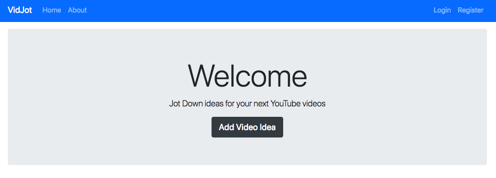
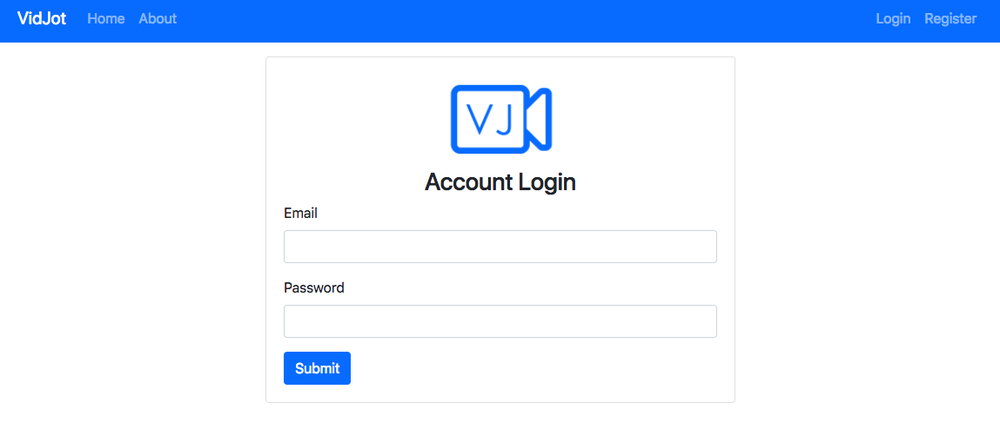
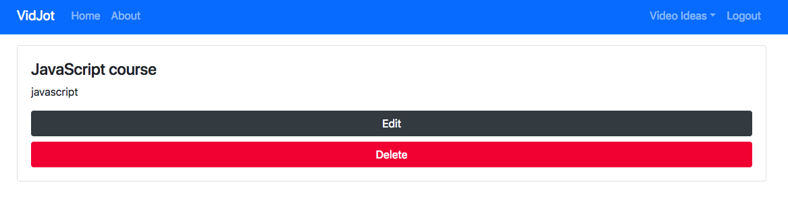

# VidJot

> an app to log Youtube video ideas.
[Link](https://aqueous-gorge-15489.herokuapp.com/)

## Quick Start

``` bash
# Install dependencies for server
npm install

# Run the Express server
npm start

# Server runs on http://localhost:5000
```
## App Info





## Built With

* Node.js
* Express
* Handlebars
* Bootstrap
* MongoDB

### Author

Bryan Wang

### Version

1.0.0

### License

This project is licensed under the MIT License